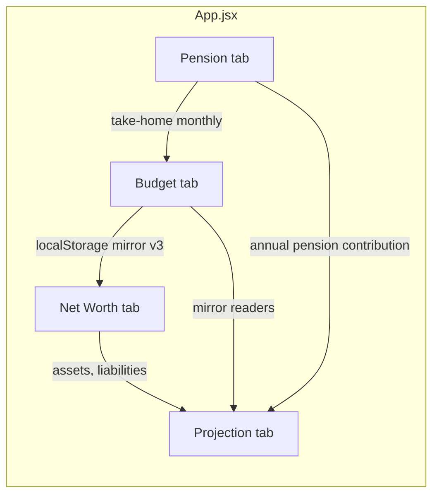

# Overall app flow

**Last updated:** 2026-04-16 (Pension take-home: share plan in net pay; Budget inherits `netMonthlyIncome`)

**Product:** UK Pension Planner — a client-side React app for pension/tax modelling, monthly budgeting, net worth, and long-horizon wealth projection. Auth is optional (Supabase); data sync varies by feature.

---

## 1. Runtime shape

- **Entry:** `src/main.jsx` → `src/App.jsx` (single page, no React Router).
- **Layout:** Header (title, auth, tab bar) + `<main>` with **four tabs** switched by `activeTab` state: `pension` | `budget` | `networth` | `projection`.
- **Mounting:** All four tab panels are **always mounted**; visibility is `hidden` vs not so internal state (e.g. Budget) is preserved when switching tabs.
- **Auth:** `useUser` + `AuthModal`; `user` is passed where needed (Budget sync, pension/net worth cloud).

---

## 2. Tab overview and dependencies

| Tab | Own state in App? | Reads from others | Feeds |
|-----|-------------------|-------------------|--------|
| Pension | Yes (`inputs`, modes, `taxRegion`, …) | — | `netMonthlyIncome` (take-home after tax/NI/pension/share plan/Plan 4 SL) → Budget; `annualPensionContribution` → Projection snapshot |
| Budget | No (inside `BudgetProvider`) | `netMonthlyIncome` from Pension | **Budget mirror** (`plannedMonthlyOutgoings.js`) → Net Worth insights, Projection snapshot |
| Net Worth | Yes (`netWorthInputs`, metadata) | Budget mirror for essential costs + **mortgage balance** (liability) | Projection snapshot (balances, liabilities) |
| Projection | Yes (`projectionInputs`) | Snapshot built from Pension + Net Worth + Budget mirror | Display only (inputs sync to `projection_inputs` when signed in) |

---

## 3. Cross-tab “mirror”: Budget

Non-budget code must **not** read raw budget row storage directly for feature logic. It uses **`src/features/budget/domain/plannedMonthlyOutgoings.js`**:

- Canonical key: `BUDGET_MIRROR_STORAGE_KEY` (`pension-planner-budget-mirror`), **mirror version 3**.
- `BudgetProvider` computes planned outgoings and calls `syncBudgetMirrorToStorage` so other tabs get stable aggregates: essential monthly costs, monthly savings (total/cash/stock), **mortgage summary** (from `housing_mortgage` expenditure rows + metadata).

**App.jsx** uses:

- `readEssentialMonthlyCostsFromBudgetMirror`
- `readMonthlySavingsFromBudgetMirror` / cash / stock
- `readMortgageSummaryFromBudgetMirror`

for Net Worth insights and the projection snapshot. Dependencies include `activeTab` so switching tabs refreshes readers that depend on mirror freshness.

---

## 4. Persistence map

| Data | Signed out | Signed in (Supabase) |
|------|------------|------------------------|
| Pension inputs + UI prefs | `localStorage` `pension-planner-inputs` | `pension_inputs` (load on login, debounced upsert) |
| Budget rows + debts + savings + cards + goals + buffer | `localStorage` keys in `features/budget/persistence/keys.js` | Rows via `budgetSync.js` (bundle fetch / per-row upserts) |
| Budget mirror (aggregates) | Written with budget; read by App | Same device; cloud is row-level not mirror |
| Net Worth bundle | `netWorthLocalPersistenceAdapter` | `net_worth_inputs` (fetch + debounced upsert) |
| Projection inputs | `localStorage` `STORAGE_KEY_PROJECTION` (always) | `projection_inputs` (fetch on login, debounced upsert after load gate) |

**Sign-out** (`handleSignOut` in `App.jsx`): clears pension + projection keys, `clearBudgetLocalStorageForSignOut()`, resets pension form state; Net Worth reloads from local adapter when `user` is null.

---

## 5. Derived pipelines (high level)

1. **Pension:** `calculateFullPosition` (`utils/calculations.js`) from salary, contribution %, pension net, region, share plan, student loan, bonus, BIK → `position` → charts and panels.
2. **Net Worth:** `computeNetWorthSummary` / `computeNetWorthInsights` from assets + manual liabilities (`loans`, `creditCards`) + **derived mortgage from budget mirror**; insights optionally use essential monthly costs from budget mirror. Saved Net Worth bundles omit mortgage; legacy `mortgageBalance` in old JSON is read only for migration then stripped (`normalizeNetWorthInputs`).
3. **Projection:** `projectionSnapshot` useMemo in `App.jsx` bundles net worth asset/liability fields, budget mirror savings + mortgage, and pension annual contribution → `computeProjectionSeries` (`utils/projectionSummary.js`) with user-editable growth/escalation inputs. Year rows include **asset attribution** (starting total assets, cumulative contributions, growth residual) for transparency; net worth still uses liabilities as today.

---

## 6. Maturity / stage (for another AI)

- **Core:** Pension modelling and UI are the original centre; tax rules live in `data/taxRules.js` (see `logic-data-flow.md` for known modelling gaps, e.g. PA taper).
- **Budget:** Full feature behind `BudgetProvider` with mortgage-aware expenditure rows and Supabase sync.
- **Net Worth:** Tab + persistence + import/export; integrated with insights and projection inputs.
- **Projection:** Forward-looking series driven by snapshot + projection settings (device mirror + cloud sync when signed in).
- **Ops:** `supabase/sql-manifest.json` and `supabase/**` SQL for schema; deploy notes in repo root `DEPLOY.md` if present.

---

## 7. Where to edit what

| Concern | Primary locations |
|---------|-------------------|
| Tab order / labels | `App.jsx` nav + `constants/labelMap.js` |
| Pension maths | `utils/calculations.js`, `data/taxRules.js` |
| Budget behaviour | `features/budget/hooks/BudgetProvider.jsx`, `domain/*` |
| Mirror contract | `features/budget/domain/plannedMonthlyOutgoings.js` |
| Net Worth maths + storage | `utils/netWorthSummary.js`, `netWorthStorage.js`, `netWorthSupabase.js` |
| Projection maths + cloud I/O | `utils/projectionSummary.js`, `projectionDefaults.js`, `projectionSupabase.js` |

Per-tab narrative: see [tabs/](./tabs/).
